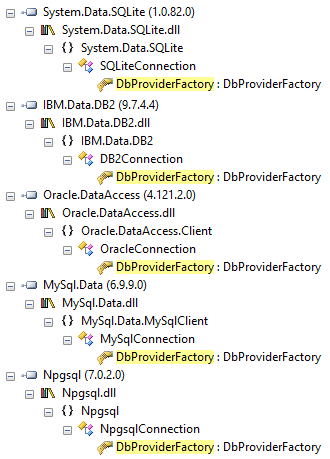

# Bouyei.DbFactory

source - https://gitee.com/bouyei/Bouyei.DbFactory  
nuget - https://www.nuget.org/packages/Bouyei.DbFactory  

---

This repo is a mirror by original. This library uses `DbProviderFactories`. Don't forget :

> The DbProviderFactories.GetFactory method uses **reflection** to dynamically load the appropriate database provider assembly and create an instance of the DbProviderFactory class for that provider.

1. The method looks for the **provider name** or invariant name in the registered provider list.
2. If a matching entry is found, it **retrieves** the assembly name and type name associated with that provider.
3. The method loads the assembly by calling `Assembly.Load` or Assembly.LoadFrom with the assembly name.
4. Once the assembly is loaded, it uses **reflection** to obtain the Type object for the `DbProviderFactory` class specified by the type name.
5. Finally, it creates an instance of the DbProviderFactory class by calling Activator.CreateInstance with the Type object.

  

When tried to make a universal class (IDbConnection / IDbCommand / IDataReader), the problem is the [IDbDataAdapter](https://learn.microsoft.com/en-us/dotnet/api/system.data.idbdataadapter), without DataAdapter cannot fill a Datatable.. Cannot be `created`, and must always instantiated as for example `OleDbDataAdapter sqlAD = new OleDbDataAdapter();` on all providers.. The only solution is the `DbProviderFactory`, which sucks...  

* (2022) [Simplifying ADO.NET Code](https://www.codemag.com/Article/2207021/Simplifying-ADO.NET-Code-in-.NET-6-Part-1)
* (2014) [Simplified Database Access via ADO.NET](https://www.codeproject.com/Articles/753789/Simplified-Database-Access-via-ADO-NET-Interfaces)

---

official library description :   

.net universal access library for heterogeneous databases, supports db2, sql server, oracle, mysql, acess and other types of database operations, uses a unified and concise interface to call, and provides db2, sqlserver, oracle's million-level high-performance batch storage method bulkcopy, and provides it to the entity framework encapsulation module, the interface is simple and simple；

Install-Package Bouyei.DbFactory -Version 1.1.6601.28462

```csharp
#1. ADO usage example
 
	string connectionString = "Data Source=.;Initial Catalog=testdb;User ID=sa;Password=bouyei;";

	IAdoProvider adoProvider = AdoProvider.CreateProvider(connectionString);

	var rt = adoProvider.Query(new Parameter()
	{
		CommandText = "select * from MemUser"
	});

	//Delete
	var del= adoProvider.Delete<user>(x => x.name == "hello");

    //Insert
	  var insert = adoProvider.Insert<user>(new user() {
                 name="bouyei",
                 age=30
            });

	//Query
	var users = adoProvider.Query<user>(x => 1 == 1);

	foreach (DataRow dr in rt.Result.Rows)
	{
		Console.WriteLine(string.Join(",", dr.ItemArray));
	}


#2. EF usage example


//entity framework Examples of use：
//  <connectionStrings>
//  <add name="DbConnection" connectionString="Data Source=127.0.0.1;Initial //Catalog=dbprovider;uid=sa;pwd=123456;MultipleActiveResultSets=True" //providerName="System.Data.SqlClient"/>
//</connectionStrings>
  <appSettings>
//Required configuration to use the entity framework module：
//<appSettings>
//  <add key="mappingDLL" value="Bouyei.DbEntities.dll"/>
//</appSettings>


	   IOrmProvider ormProvider = OrmProvider.CreateProvider("DbConnection");
            try
            {
                User item = ormProvider.GetById<User>(1);
                UserDto ud = new UserDto()
                {
                    UserName = "http://aileenyin.com/"
                };

                var query = ormProvider.Query<User>().FirstOrDefault();

                //Use mapper to modify objects
                EntityMapper.MapTo<UserDto, User>(ud, item);
                ormProvider.Update(item,true);//true直接保存更改
                //Save the changes separately
                //int rt = ormProvider.SaveChanges();


#3. Database table synchronization

            List<SyncTableSchema> tableSchema = new List<SyncTableSchema>();
            tableSchema.Add(new SyncTableSchema()
            {
                TableName = "user",
                Columns = new List<SyncColumnName>() {
                    new SyncColumnName("name"){ DataType="nvarchar",Size=50},
                    new SyncColumnName("id"){ DataType="int", IsPrimaryKey= true, IncrementStart=1, IncrementStep=1,Size=4},
                    new  SyncColumnName("no"){ DataType="int",Size=4},
                    new SyncColumnName("age"){DataType="int",Size=4 }
                }
            });

            string sourceConnString = "Server=127.0.0.1;Database=A;User Id=sa;Password=bouyei;";
            string targetConnString = "Server=127.0.0.1;Database=B;User Id=sa;Password=bouyei;";
            dbSyncProvider = DbSyncProvider.CreateProvider(sourceConnString, targetConnString,
                "ScopeName", tableSchema);

            //To clear the synchronization record settings, you need to reinitialize the settings
            dbSyncProvider.DeprovisionScope();

            //Reset the synchronization record settings and need to be initialized for the first time
            // dbSyncProvider.ProvisionScope(null);

            dbSyncProvider.ProvisionScope(new List<SyncFilterSchema>() {
                 new SyncFilterSchema(){
                      FilterColumns=new List<string>(){"[age]"},
                      FilterClause="[side].[age]>20"
                 }
            });

            var rt = dbSyncProvider.ExecuteSync(new SyncParameter()
            {
                Direction = SyncDirectionType.Upload,
            });
```
