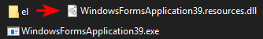

# Multilanguage UI - Satellite assemblies & DI Resource Service

traditional in winforms to produce satellite assemblies (aka multilanguage application)

turning to any language you like, alter the controls text, now IDE generates `Form1.languageISOcode.resx`  

compiling this project getting :  

The `Default language` by nature embedded to executable. Browsing the compiled exe & el.resource.dll

## custom text
For custom text, define it on `Properties.Resources`.  

then right click `add new entry` > resource file  

this file will be created on project root, move it to `Properties` folder (near the default one), and rename it accordingly by ISO name, ex. for Greek `Resources.el.resx`  

now at code, as the `Form Language`, any time your change the `CultureInfo`, the `resources.languageISOcode.resx` automatically used.  

references required :  
* [Microsoft.Bcl.AsyncInterfaces](https://www.nuget.org/packages/Microsoft.Bcl.AsyncInterfaces/8.0.0)
* [Microsoft.Extensions.DependencyInjection.Abstractions](https://www.nuget.org/packages/Microsoft.Extensions.DependencyInjection.Abstractions/8.0.0)
* [Microsoft.Extensions.DependencyInjection](https://www.nuget.org/packages/Microsoft.Extensions.DependencyInjection/8.0.0)
* [System.Threading.Tasks.Extensions](https://www.nuget.org/packages/System.Threading.Tasks.Extensions/4.5.4)  

reference :  
* [Create satellite assemblies for .NET apps](https://learn.microsoft.com/en-us/dotnet/core/extensions/create-satellite-assemblies)
* [All you wanted to know about Satellite Assemblies](https://www.codeproject.com/Articles/801343/All-you-wanted-to-know-about-Satellite-Assemblies)