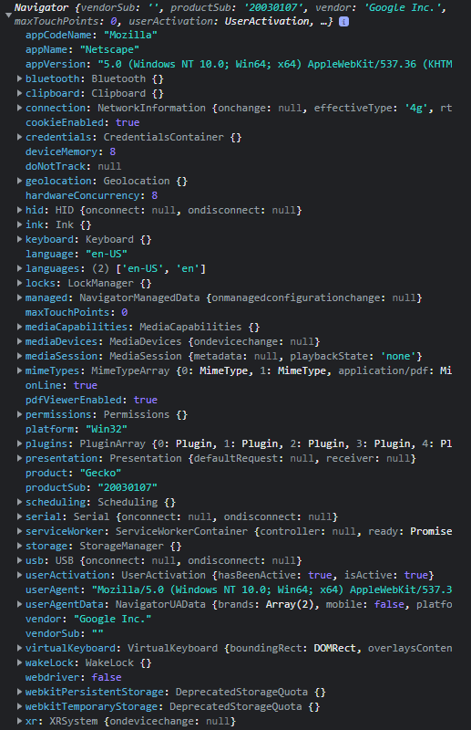
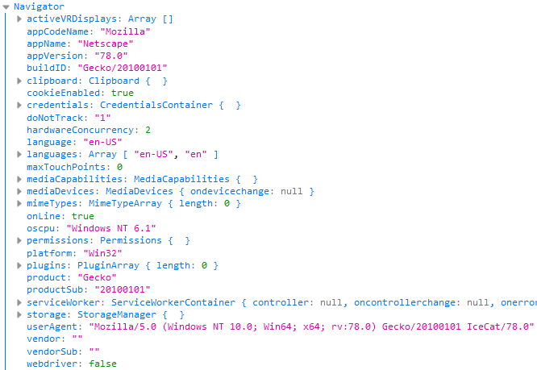
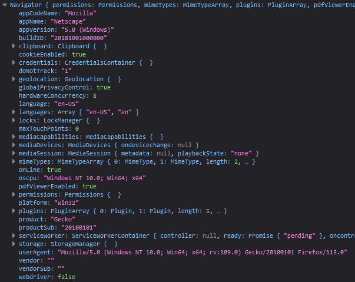
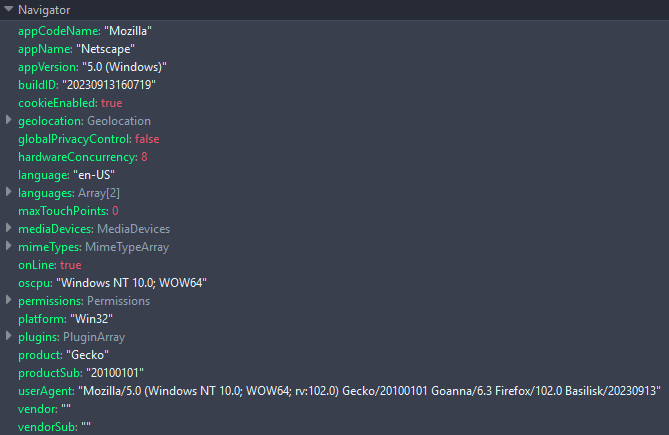
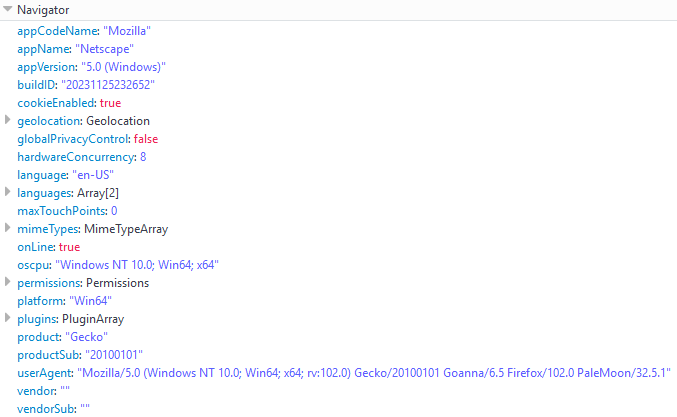
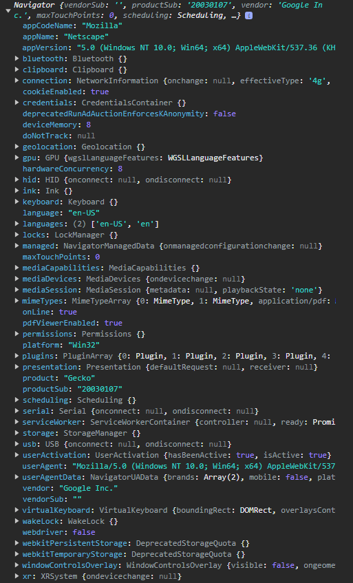
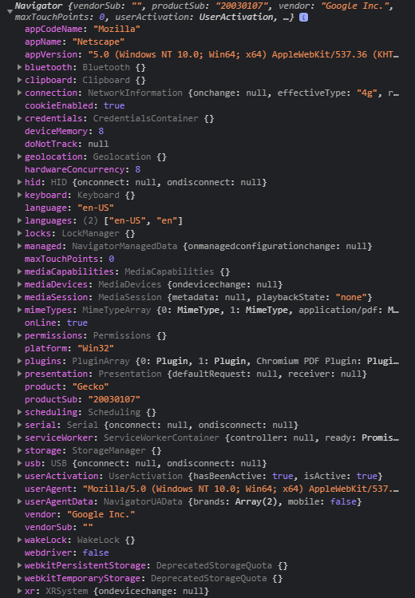

# browsers navigator outputs

Using `console.log(navigator)` to any browser you see what you share with pages.  

* `Blink` is engine by Google  
* `Gecko` is engine by Mozilla  
* `Goanna` is engine by Pale Moon ( fork of Gecko )

---

## [Beacon](https://github.com/imperviousinc/beacon) v100 (blink)


## [Brave](https://github.com/brave/brave-browser) v159 (blink)


## [Icecat](https://codeberg.org/chippy/icecat-for-windows) v78 (gecko)


## [LibreWolf](https://codeberg.org/librewolf/source) v109 (gecko)


## [Mercury](https://github.com/Alex313031/Mercury) v115 (gecko)


## [Basilik](https://repo.palemoon.org/Basilisk-Dev/Basilisk) v20230912 (goanna)


## [Pale Moon](https://repo.palemoon.org/MoonchildProductions/Pale-Moon) v32.5.1 (goanna)


## [SRWare Iron](https://www.srware.net/iron/) v118 (blink)


## [Ungoogled](https://github.com/ungoogled-software/ungoogled-chromium) v91 (blink)


only `Mercury` / `Basilik` / `Pale Moon` **not** expose the **service worker**. And interestingly we see all output 
```js
product: "Gecko"
``` 

because of javascript engine ;) 