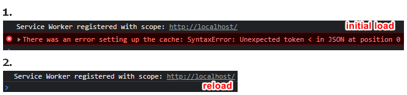
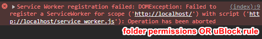

# service_worker example

nothing to see on page, turn on devtools. Possible outputs are :






---

## story 

```js
//index.html
if ('serviceWorker' in navigator) {  //  if the browser supports Service Workers. 
  navigator.serviceWorker.register('/service_worker.js')
```

*by GPT*  
If you want to disable `navigator.serviceWorker` for all pages, there is no builtin method for Chrome (**Firefox** has a switch). You can create an addon (no tested) where **background.js** :
```js
chrome.webNavigation.onCompleted.addListener(details => { //listen for the completion of page navigation 
  chrome.tabs.executeScript(details.tabId, { //inject a script into the page, setting navigator.serviceWorker to undefined
    code: `
      Object.defineProperty(navigator, 'serviceWorker', {
        value: undefined,
        writable: false,
        configurable: false
      });
    `
  });
});
```  