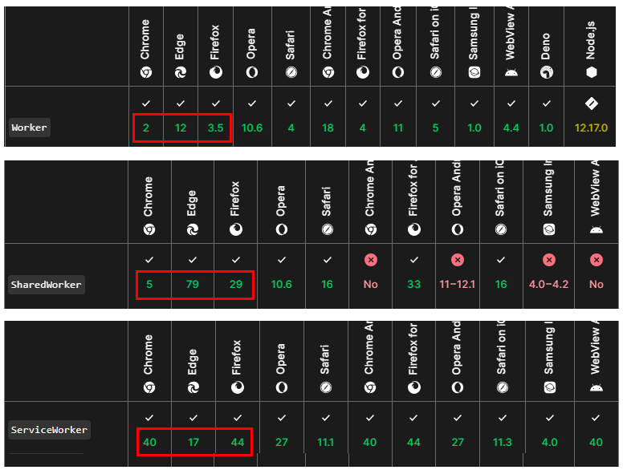
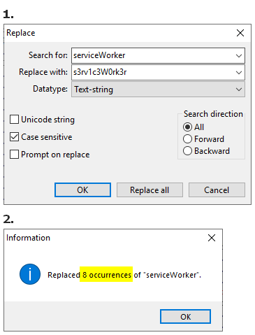

# Workers

There are `3 types` of workers :
* Worker
* SharedWorker
* ServiceWorker  



As we see both `Worker & SharedWorker` introduced in early versions
* Worker | Chrome 2 (2009) | Firefox 3.5 (2009) | ~~Edge 12 (2015)~~
* SharedWorker | Chrome 5 (2010) | Firefox 29 (2014)  | ~~Edge 79 (2020)~~

afterwards `ServiceWorker` 
* Chrome 40 (2015) | Firefox 44 (2016) | ~~Edge 17 (2018)~~

> The **Worker & SharedWorker** when the tab closed, stop exist, while the **ServiceWorker** continue running on background.

---

* `Worker` - runs scripts in the background separate from the main thread of the web page.
* `SharedWorker` - similar to a regular `Worker` but can be shared among multiple browsing contexts, such as multiple tabs or frames.
* `Service Worker` - run **independently** of the specific page that registered it. Can continue running in the background even when the page that registered them **is closed**. Used for tasks such as caching resources, background sync, and push notifications. Can **respond** to events **even** when the associated web page **is not active**.

---

## View `Service Workers` registered on your browser 

firefox :
* `about:serviceworkers`
* `about:debugging#/runtime/this-firefox` 
* devtools > Application  

chrome :
* `chrome://serviceworker-internals/`
* devtools > Application


---

## Disable `Service Workers`  

firefox :  
* about:config
* set false 
    * dom.serviceWorkers.enabled
    * dom.webnotifications.serviceworker.enabled
    * extensions.backgroundServiceWorker.enabled

chrome there is no option, but only workarounds :
* there are [3 addons](https://chromewebstore.google.com/detail/no-service-worker/mbhfklemgegigbfbfmfdmijkcnabgpmf) on marketplace that set the **navigation.serviceWorker** to undefined, on every page you visit (no tested)
* there is a [uBlock rule](https://bonina.eu/web/disable-service-workers-chromium-browsers/) but disables as well the `Worker & SharedWorker` (not advisable)
* The `Service Workers` have a **dedicated folder** on Chrome profile (mine was `787mb`). This folder is **C:\Users\user\AppData\Local\Chome\User Data\Default\Service Worker**, you can delete the contents and then apply folder permissions as is described [here](https://imgur.com/a/8re6Bjo).
* patch with [hexeditor](https://mh-nexus.de/en/hxd/) the `chrome.dll`. Rename (ASCII + case sensitive) the **serviceWorker** to **s3rv1c3W0rk3r** (or any other name you like but should have the same characters size). In that way the property **serviceWorker** in **navigation** object will never exist so nobody can registered to.



---

## What is navigation object ?

Is a global object in JavaScript that **provides information** about the browser environment. It represents the state and **identity** of the user agent (i.e., the web browser). The **navigator object** provides various properties and methods that allow you to **retrieve information** about the browser and control some aspects of its behavior. For more on that, see the **browsers_navigator_outputs** folder.

`navigator.serviceWorker` - Is a **property** of the **navigator object** that **exposes** the `Service Worker API`. It allows you to register, unregister, and communicate with Service Workers.  

-- 

`Chromium` - The `navigator` object is implemented as part of the **Blink rendering** engine. You would find it in the [Blink repository](https://chromium.googlesource.com/chromium/blink/+/refs/heads/main/Source/modules/serviceworkers).  

`Firefox` - The `navigator` object is implemented as part of the **Gecko rendering** engine. You would find it in the [Gecko repository](https://github.com/mozilla/gecko-dev/tree/master/dom/serviceworkers) [[2](https://hg.mozilla.org/mozilla-central/file)].  

---

To perfom the needed tests, used the samples included here (both needed to be run on a server):
* check_serviceworker
* check_3_types_of_worker
* (3rd party) https://julienboulay.github.io/ngsw-brave/ - (Angular PWA thinks that registered)

I would like to thank 
* [Thorium.Mercury](https://thorium.rocks/mercury) - a minimal firefox browser
* [portapps](https://portapps.io/app/brave-portable/) - portable brave  

you still using google apps after all (????)  

---

Initially all this information drafted [here](https://www.pipiscrew.com/threads/webrowser-service-workers.99503/) and is not happened in a week!  

**browser compatibility** references :
* [Worker](https://developer.mozilla.org/en-US/docs/Web/API/Worker)
* [SharedWorker](https://developer.mozilla.org/en-US/docs/Web/API/SharedWorker)
* [ServiceWorker](https://developer.mozilla.org/en-US/docs/Web/API/ServiceWorker)

---

command line examples for use different `PROFILE` folder than the default in %appdata% (greets to Thorium)
```bash
chrome
START "" "chrome.exe" --user-data-dir="%~dp0%\USER_DATA" --allow-outdated-plugins --disable-logging --disable-breakpad

firefox
START "" "firefox.exe" --profile "%~dp0%\USER_DATA"

```

btw  
when you working for a corporation and you see on browser settings `managed by your administrator` or `your browser is managed by zzzzzz` see what achive https://support.google.com/chrome/a/answer/9227157  