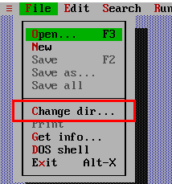
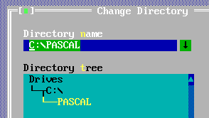
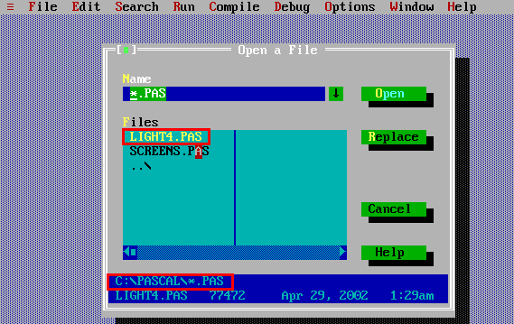
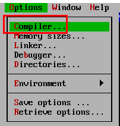
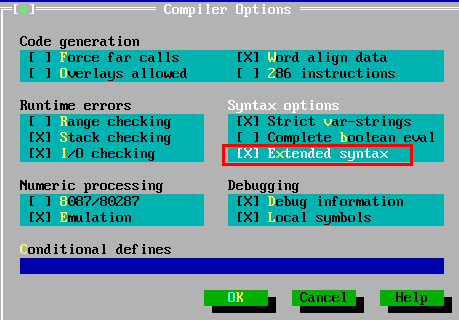
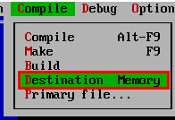
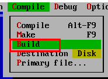

# TelephoneBook

A very old project.  

https://github.com/pipiscrew/timeline/assets/3852762/9f03d040-beee-464a-955c-11b50bbf1104

To compile it :
* must have DosBox with Turbo Pascal >= v6.0
* `change dir` to project folder
* enable `extended syntax`  

---

  

  

  

  

  

  

  